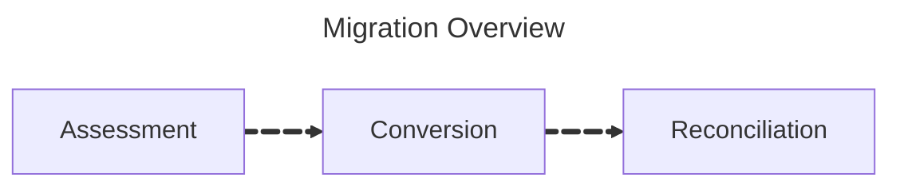

import useBaseUrl from '@docusaurus/useBaseUrl';

Overview
========

Lakebridge is a comprehensive toolkit designed to help you manage all phases of your SQL migration, from initially surveying your existing landscape through to translation of SQL and final data reconciliation.

1. [_Pre-migration:_](#pre-migration-assessment) Assessing your existing landscape, helping you understand the impact and effort of your migration to Databricks.
2. [_Converting_](#converting-sql-workloads) your SQL-based workloads, using the proven BladeBridge solution or our next-generation transpiler.
3. [_Post-migration:_](#post-migration-reconciliation) Reconciling datasets that you've transferred from an existing warehouse or data lake into Databricks.

Pre-migration Assessment
------------------------

The assessment phase is where we analyze your existing SQL workloads and their orchestration, with a view to helping you understand ahead of your migration to Databricks: a) the total cost of ownership (TCO) before you start; b) the complexity and effort of the migration itself. We split this up into two main tasks:

 - _Profiling_ your existing SQL workloads. The profiler connects to your existing SQL environment and examines its workloads, providing you with a detailed report on their size, complexity and features used. From this we can estimate the savings of running the same workloads once they have been migrated to Databricks.
 - _Analyzing_ the SQL code, and if necessary its orchestration. This scan provides you with a detailed report on the size and complexity of the code, and identifies potential issues that may arise during migration. This helps you understand the effort that will be required to update your SQL jobs, and if necessary its orchestration, for Databricks.

The key purpose here is to provide you as early as possible with a clear understanding of both the TCO benefits of migrating to Databricks, while also being aware of the effort and potential issues this may involve. Aside from setting expectations, this is crucial for planning and understanding the risks associated with your migration.

For more information on using the assessment tools that we provide, refer to the [Profiler][1] and [Analyzer][2] documentation.

Converting SQL Workloads
------------------------

For migrating your SQL workloads we provide transpilers that can:

 - Translate SQL code from a variety of source platforms to Databricks SQL.
 - Translate some orchestration and ETL code to Databricks SQL.

Internally, Lakebridge can use three different transpilers:

 - *BladeBridge*, a mature transpiler that can handle a wide range of source dialects as well as some ETL/orchestration.
 - *Morpheus*, a next-generation transpiler that currently handles a smaller set of dialects, but includes experimental support for dbt.
 - *Switch*, an LLM-powered transpiler that uses Large Language Models to convert SQL and other source formats to Databricks notebooks.

For more information on using the transpilers, refer to the [Transpile][3] documentation.

Post-migration Reconciliation
-----------------------------

During the migration process, datasets are often transferred from the existing source platform into Databricks. Lakebridge's reconciler is designed to help you ensure that the data in Databricks matches that of the source system, bearing in mind that both might be part of live environments.

For more information on using the data reconciliation tools, refer to the [Reconcile][4] documentation.

Supported sources
----------------------------
<table>
  <thead>
    <tr>
      <th>Source system type</th>
      <th>Source Technology</th>
      <th>Assessment - Profiler</th>
      <th>Assessment - Analyzer</th>
      <th>Converter</th>
      <th>Reconcile</th>
    </tr>
  </thead>
  <tbody>
    <!-- SQL -->
    <tr>
      <td rowspan="17">SQL</td>
      <td>athena</td>
      <td></td>
      <td>&#x2705;</td>
      <td></td>
      <td></td>
    </tr>
    <tr>
      <td>big query</td>
      <td></td>
      <td>&#x2705;</td>
      <td></td>
      <td></td>
    </tr>
    <tr>
      <td>db2</td>
      <td></td>
      <td>&#x2705;</td>
      <td></td>
      <td></td>
    </tr>
    <tr>
      <td>greenplum</td>
      <td></td>
      <td>&#x2705;</td>
      <td></td>
      <td></td>
    </tr>
    <tr>
      <td>hive</td>
      <td></td>
      <td>&#x2705;</td>
      <td></td>
      <td></td>
    </tr>
    <tr>
      <td>mssql</td>
      <td></td>
      <td>&#x2705;</td>
      <td>&#x2705;</td>
      <td>&#x2705;</td>
    </tr>
    <tr>
      <td>mysql</td>
      <td></td>
      <td>&#x2705;</td>
      <td>&#x2705;</td>
      <td></td>
    </tr>
    <tr>
      <td>netezza</td>
      <td></td>
      <td>&#x2705;</td>
      <td>&#x2705;</td>
      <td></td>
    </tr>
    <tr>
      <td>oracle</td>
      <td></td>
      <td>&#x2705;</td>
      <td>&#x2705;</td>
      <td>&#x2705;</td>
    </tr>
    <tr>
      <td>postgresql</td>
      <td></td>
      <td>&#x2705;</td>
      <td>&#x2705;</td>
      <td></td>
    </tr>
    <tr>
      <td>presto</td>
      <td></td>
      <td>&#x2705;</td>
      <td></td>
      <td></td>
    </tr>
    <tr>
      <td>redshift</td>
      <td></td>
      <td>&#x2705;</td>
      <td>&#x2705;</td>
      <td></td>
    </tr>
    <tr>
      <td>sap hana (calc views)</td>
      <td></td>
      <td>&#x2705;</td>
      <td></td>
      <td></td>
    </tr>
    <tr>
      <td>snowflake</td>
      <td></td>
      <td>&#x2705;</td>
      <td>&#x2705;</td>
      <td>&#x2705;</td>
    </tr>
    <tr>
      <td>synapse</td>
      <td>&#x2705;</td>
      <td>&#x2705;</td>
      <td>&#x2705;</td>
      <td>&#x2705;</td>
    </tr>
    <tr>
      <td>teradata</td>
      <td></td>
      <td>&#x2705;</td>
      <td>&#x2705;</td>
      <td></td>
    </tr>
    <tr>
      <td>vertica</td>
      <td></td>
      <td>&#x2705;</td>
      <td></td>
      <td></td>
    </tr>

    <!-- ETL -->
    <tr>
      <td rowspan="10">ETL</td>
      <td>abinitio</td>
      <td></td>
      <td>&#x2705;</td>
      <td></td>
      <td></td>
    </tr>
    <tr>
      <td>alteryx</td>
      <td></td>
      <td>&#x2705;</td>
      <td></td>
      <td></td>
    </tr>
    <tr>
      <td>datastage</td>
      <td></td>
      <td>&#x2705;</td>
      <td>&#x2705;</td>
      <td></td>
    </tr>
    <tr>
      <td>pentahodi</td>
      <td></td>
      <td>&#x2705;</td>
      <td></td>
      <td></td>
    </tr>
    <tr>
      <td>pig</td>
      <td></td>
      <td>&#x2705;</td>
      <td></td>
      <td></td>
    </tr>
    <tr>
      <td>pyspark</td>
      <td></td>
      <td>&#x2705;</td>
      <td></td>
      <td></td>
    </tr>
    <tr>
      <td>sas</td>
      <td></td>
      <td>&#x2705;</td>
      <td></td>
      <td></td>
    </tr>
    <tr>
      <td>sqoop</td>
      <td></td>
      <td>&#x2705;</td>
      <td></td>
      <td></td>
    </tr>
    <tr>
      <td>ssis</td>
      <td></td>
      <td>&#x2705;</td>
      <td>&#x2705;</td>
      <td></td>
    </tr>
    <tr>
      <td>talend</td>
      <td></td>
      <td>&#x2705;</td>
      <td></td>
      <td></td>
    </tr>

    <!-- Orchestration -->
    <tr>
      <td rowspan="3">Orchestration</td>
      <td>airflow</td>
      <td></td>
      <td></td>
      <td>&#x2705;</td>
      <td></td>
    </tr>
    <tr>
      <td>adf</td>
      <td></td>
      <td>&#x2705;</td>
      <td></td>
      <td></td>
    </tr>
    <tr>
      <td>oozie</td>
      <td></td>
      <td>&#x2705;</td>
      <td></td>
      <td></td>
    </tr>

    <!-- Generic/Other -->
    <tr>
      <td rowspan="5">Generic/Other</td>
      <td>cloudera (impala)</td>
      <td></td>
      <td>&#x2705;</td>
      <td></td>
      <td></td>
    </tr>
    <tr>
      <td>python</td>
      <td></td>
      <td>&#x2705;</td>
      <td>&#x2705;</td>
      <td></td>
    </tr>
    <tr>
      <td>scala</td>
      <td></td>
      <td>&#x2705;</td>
      <td>&#x2705;</td>
      <td></td>
    </tr>
    <tr>
      <td>spss</td>
      <td></td>
      <td>&#x2705;</td>
      <td></td>
      <td></td>
    </tr>
    <tr>
      <td>ssrs</td>
      <td></td>
      <td>&#x2705;</td>
      <td></td>
      <td></td>
    </tr>
  </tbody>
</table>

[1]: ../assessment/profiler/
[2]: ../assessment/analyzer/
[3]: ../transpile/
[4]: ../reconcile/
