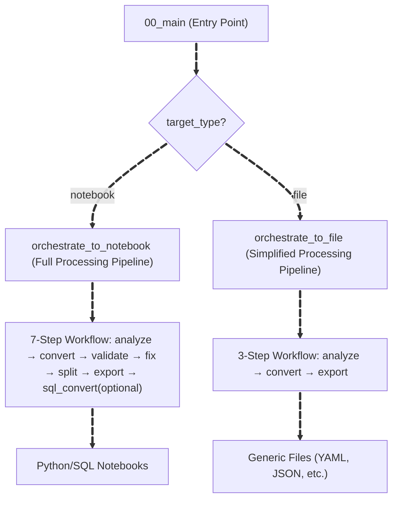
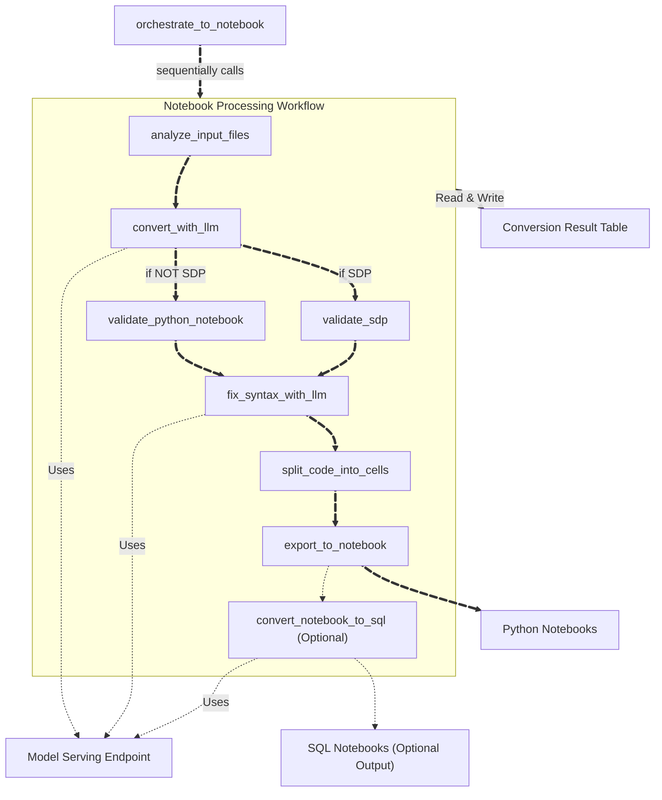
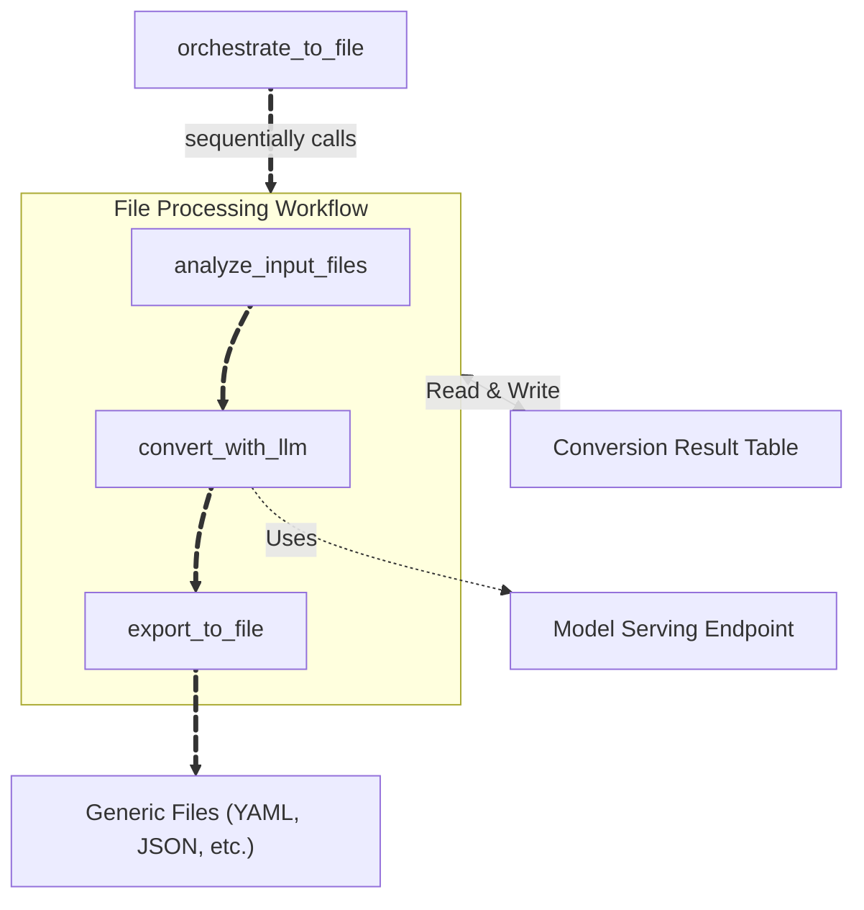

import CodeBlock from '@theme/CodeBlock';

# Switch Architecture

This page describes the internal architecture of Switch — how it executes as a Databricks Job and the processing pipeline it runs. This is useful for advanced users, contributors, and anyone debugging conversion failures.

For getting started with Switch, see the [Switch guide](/docs/transpile/pluggable_transpilers/switch).

---

## Overview

When you run Switch via the CLI, it executes as a Databricks Job using a multi-stage processing pipeline. The main orchestration notebook (`00_main`) validates parameters and routes to the appropriate orchestrator based on `target_type`.

---

## Notebook Conversion Flow

For `target_type=notebook` or `target_type=sdp`, the `orchestrate_to_notebook` orchestrator runs a 7-step pipeline:

---

## File Conversion Flow

For `target_type=file`, the `orchestrate_to_file` orchestrator uses a simplified 3-step pipeline:

File conversion skips syntax validation, error fixing, and cell splitting — it exports directly from converted content to the specified file format.

---

## Processing Steps

### analyze_input_files

Scans the input directory recursively and stores all file contents, metadata, and analysis results in a timestamped Delta table. For SQL sources, creates preprocessed versions with comments removed and whitespace normalized. Counts tokens using model-specific tokenizers (Claude uses ~3.4 characters per token; OpenAI and other models use tiktoken). Files exceeding `token_count_threshold` are excluded from conversion.

### convert_with_llm

Loads conversion prompts (built-in or custom YAML) and sends file content to the configured model serving endpoint. Multiple files are processed concurrently (default: 4, controlled by `concurrency`). For SQL sources, generates Python code with `spark.sql()` calls. For generic sources, adapts to the specified target format.

### validate_python_notebook

Checks Python syntax using `ast.parse()` and validates SQL statements within `spark.sql()` calls using Spark's `EXPLAIN` command. Errors are recorded in the result table.

### validate_sdp

Validates Spark Declarative Pipeline output:

| Step | Description |
|---|---|
| Export Notebook | Writes converted code to a temporary workspace notebook |
| Create Pipeline | Creates a temporary Spark Declarative Pipeline referencing the notebook |
| Update Pipeline | Runs a validation-only update to check for SDP syntax errors |
| Delete Pipeline | Cleans up the temporary pipeline |

`TABLE_OR_VIEW_NOT_FOUND` errors are ignored.

### fix_syntax_with_llm

Sends error context back to the model serving endpoint for automatic correction. Repeats up to `max_fix_attempts` times (default: 1). Set to 0 to disable automatic fixing.

### split_code_into_cells

Transforms raw converted Python code into well-structured notebook cells. Splits at logical boundaries (imports, function definitions, major operations) and adds markdown cells for documentation.

### export_to_notebook

Creates Databricks-compatible `.py` notebooks in the output directory. Handles files up to 10MB and preserves the original directory structure. Includes metadata, source file references, and syntax check results as comments.

### convert_notebook_to_sql (Optional)

When `sql_output_dir` is specified, uses the model serving endpoint to convert Python notebooks to SQL notebook format. Some Python-specific logic may be lost in this conversion.
