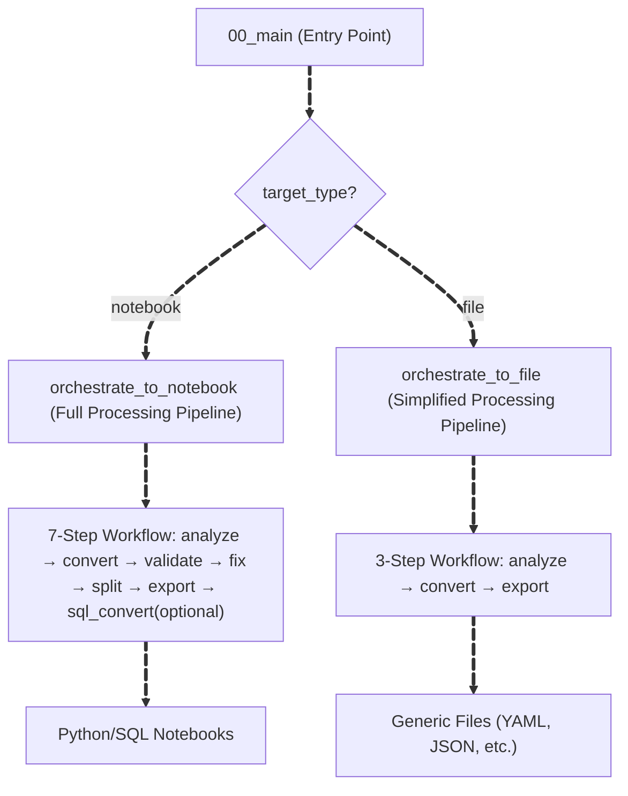
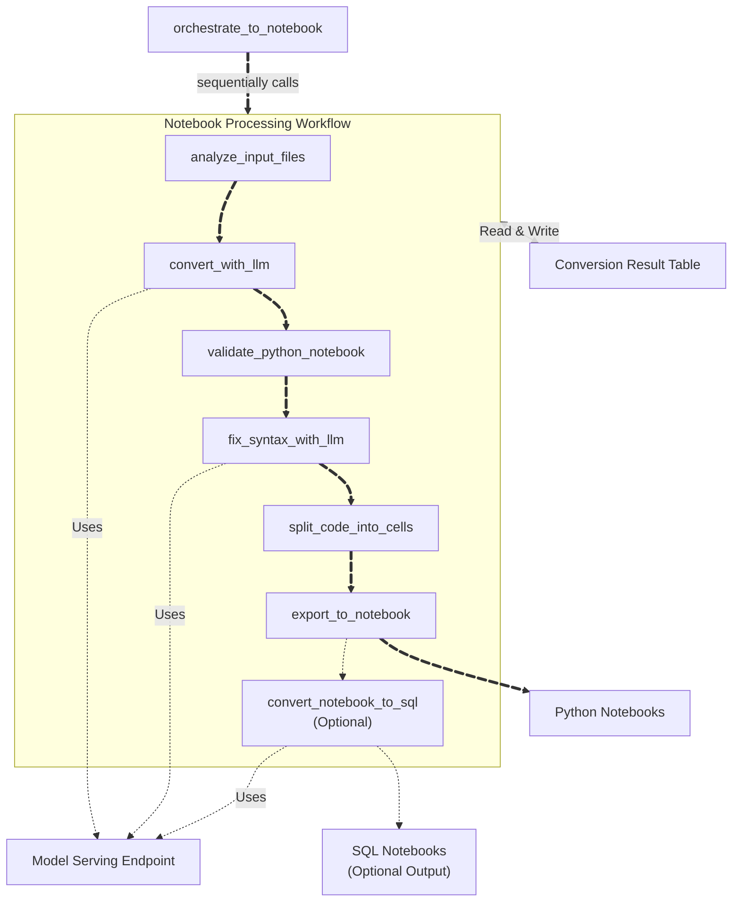
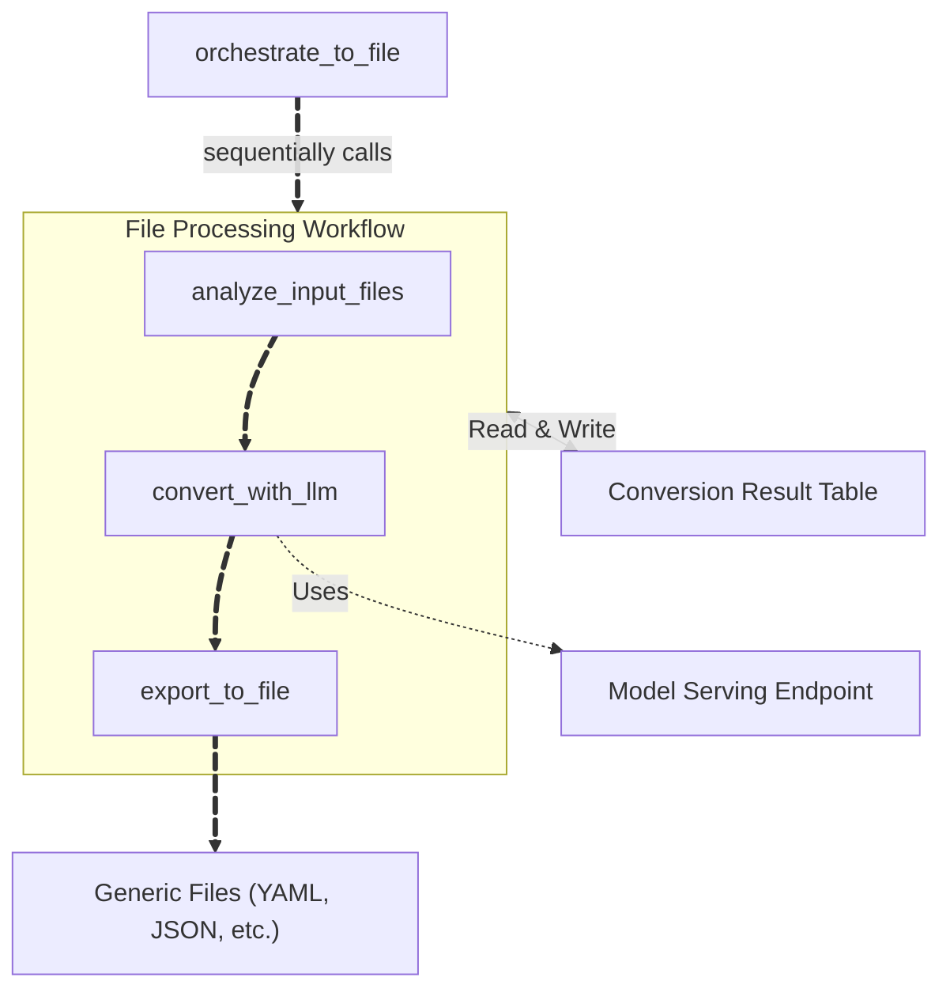

import CodeBlock from '@theme/CodeBlock';

:::warning Attention:
The Switch LLM Converter is currently an Experimental feature in Lakebridge. For any feedback and/or issues, feel free to reach out
via Github issues.
:::

**Switch** is a Lakebridge transpiler plugin that uses Large Language Models (LLMs) to convert SQL and other source formats
into Databricks notebooks or generic files. Switch leverages [Mosaic AI Model Serving](https://docs.databricks.com/aws/en/machine-learning/model-serving/)
to understand code intent and semantics, generating equivalent Python notebooks with Spark SQL or other target formats.

This LLM-powered approach excels at converting complex SQL code and business logic where context and intent matter more
than syntactic transformation. While generated notebooks may require manual adjustments, they provide a valuable foundation
for Databricks migration.

---

## How Switch Works

Switch operates through three key components that distinguish it from rule-based transpilers:

### 1. LLM-Powered Semantic Understanding
Instead of parsing rules, Switch uses [Mosaic AI Model Serving](https://docs.databricks.com/aws/en/machine-learning/model-serving/) to:
- Interpret code intent and business context beyond syntax
- Handle SQL dialects, programming languages, and workflow definitions
- Support complex logic patterns and proprietary extensions
- Enable extensible conversion through custom YAML prompts

### 2. Native Databricks Integration
Switch runs entirely within the Databricks workspace. You can find details about this architecture [here](#databricks-implementation-details)
- **Jobs API**: Executes as scalable Databricks Jobs for batch processing
- **Model Serving**: Direct integration with Databricks LLM endpoints, with concurrent processing for multiple files
- **Delta Tables**: Tracks conversion progress and results

### 3. Flexible Output Formats
- **Notebooks**: Python notebooks containing Spark SQL (primary output)
- **Generic Files**: YAML workflows, JSON configurations, and other text formats
- **Experimental**: Additional SQL notebook output converted from generated Python notebooks

---

## Requirements

Before installing Switch, ensure your Databricks environment meets the following requirements:

### Workspace Resources

- **Serverless job compute** (used by default for Switch job execution)
  - If unavailable: Manually configure the Switch job to use classic job compute with DBR 14.3 LTS or higher
- **Foundation Model API** enabled

### Unity Catalog Resources

Switch requires a Databricks catalog, schema, and volume:
- **Catalog and Schema**: Store Delta tables for state management and conversion results
    - Defaults: catalog - lakebridge, schema - switch
- **Volume**: Store uploaded input source files
    - Default: switch_volume

**Required permissions:**
- **If using existing resources**: `USE CATALOG`, `USE SCHEMA`, `CREATE TABLE`, `READ VOLUME`, `WRITE VOLUME`
- **If creating new resources**: Catalog/schema/volume creation permissions (Switch will prompt to create them when running `llm-transpile`)

---

## Source Format Support

Switch uses LLMs to convert arbitrary source formats through custom prompts, with built-in prompts for SQL dialects, programming languages, and workflow systems.

### Built-in Prompts: SQL Dialects

Convert SQL from various dialects to Databricks Python notebooks.

| Source Technology | Source Systems |
|-------------|----------------|
| `mssql` | Microsoft SQL Server, Azure SQL Database, Azure SQL Managed Instance, Amazon RDS for SQL Server |
| `mysql` | MySQL, MariaDB, and MySQL-compatible services (including Amazon Aurora MySQL, RDS, Google Cloud SQL) |
| `netezza` | IBM Netezza |
| `oracle` | Oracle Database, Oracle Exadata, and Oracle-compatible services (including Amazon RDS) |
| `postgresql` | PostgreSQL and PostgreSQL-compatible services (including Amazon Aurora PostgreSQL, RDS, Google Cloud SQL) |
| `redshift` | Amazon Redshift |
| `snowflake` | Snowflake |
| `synapse` | Azure Synapse Analytics (dedicated SQL pools) |
| `teradata` | Teradata |

### Built-in Prompts: Non-SQL Sources

Convert non-SQL files to notebooks or other formats.

| Source Technology | Source → Target |
|--------------|-----------------|
| `python` | Python Script → Databricks Python Notebook |
| `scala` | Scala Code → Databricks Python Notebook |
| `airflow` | Airflow DAG → Databricks Jobs YAML + Operator conversion guidance (SQL→sql_task, Python→notebook, etc.) |

### Custom Prompts: Any Source Format

Switch's LLM-based architecture supports additional conversion types through custom YAML conversion prompts, making it extensible beyond built-in options.

For custom prompt creation, see the [Customizable Prompts](/docs/transpile/pluggable_transpilers/switch/customizing_switch#customizable-prompts) section.

---

## Installation

Install Switch using the `install-transpile` command with the `--include-llm-transpiler` option:

```bash
databricks labs lakebridge install-transpile --include-llm-transpiler true --profile profile_name
```

The installation automatically:

1. **Uploads Notebooks**: Switch processing notebooks to workspace
2. **Creates Databricks Job**: Configured job in your workspace for running conversions

---

## Usage

Use the `llm-transpile` command to run Switch conversions. The command takes local file paths as input and automatically uploads them to Unity Catalog Volumes before processing:

```bash
databricks labs lakebridge llm-transpile \
  --input-source /local/path/to/input \
  --output-ws-folder /Workspace/path/to/output \
  --source-dialect mysql \
  --accept-terms true \
  [--catalog-name your_catalog] \
  [--schema-name your_schema] \
  [--volume your_volume] \
  [--foundation-model your_foundation_model] \
  [--profile profile_name]
```

When executing the above command, the response will look like this:

```console
INFO [d.l.l.transpiler.switch_runner] Uploading /local/path/to/input to your_volume
INFO [d.l.l.transpiler.switch_runner] Upload complete: your_volume/input-xyz
INFO [d.l.l.transpiler.switch_runner] Triggering Switch job with job_id: <switch_job_id>
INFO [d.l.l.transpiler.switch_runner] Switch LLM transpilation job started: https://workspace.databricks.com/jobs/switch_job_id/runs/run_id
```

### Operational Notes

Switch operates differently from other Lakebridge transpilers:

- **Local Input Paths**: Input files are read from your local filesystem and automatically uploaded to Unity Catalog Volumes
- **Workspace Output Paths**: Output is written to Databricks Workspace paths specified in the `--output-ws-folder` param (e.g., `/Workspace/path/to/...`)
- **Jobs API Execution**: Switch runs as a Databricks Job in your workspace, not as a local process
- **Asynchronous by Default**: The command returns immediately with a job URL, allowing you to monitor progress in the Databricks workspace
- **Monitoring**: Use the returned job URL to track conversion progress and view logs

---

## Configuration

Switch provides flexible configuration through two tiers: command-line parameters for each execution and Switch configuration file for customizing conversion behavior.

### Command-Line Parameters

The `llm-transpile` command accepts the following parameters:

| Parameter | Specification | Description | Example |
|-----------|---------------|-------------|---------|
| `--input-source` | Required | Local file system path containing files to convert (automatically uploaded to Volume) | `/local/path/to/input` |
| `--output-ws-folder` | Required | Databricks workspace path for generated outputs (must start with `/Workspace/`) | `/Workspace/path/to/output` |
| `--source-dialect` | Required | Source technology/dialect to convert from (see [Source Format Support](#source-format-support) for available options) | `snowflake`, `oracle`, `python`, `airflow`, etc. |
| `--accept-terms` | Required | Whether to accept the terms for using LLM-based transpilation (`true\|false`) | `true`|
| `--catalog-name` | Optional (prompted, default: `lakebridge`) | Unity Catalog for Switch Delta tables and Volume | `your_catalog` |
| `--schema-name` | Optional (prompted, default: `switch`) | Schema within the catalog for Switch Delta tables and Volume | `your_schema` |
| `--volume` | Optional (prompted, default: `switch_volume`) | Unity Catalog Volume for uploaded input source files | `your_volume` |
| `--foundation-model` | Optional (prompted from available FM APIs) | Model serving endpoint name for conversions | `databricks-claude-sonnet-4-5` |

### Switch Configuration File

Additional conversion parameters are managed in the Switch configuration file. You can edit this file directly in your workspace to customize Switch's conversion behavior.

**File location:** `/Workspace/Users/{user}/.lakebridge/switch/resources/switch_config.yml`

| Parameter | Description | Default Value | Available Options |
|-----------|-------------|---------------|-------------------|
| `target_type` | Output format type. `notebook` for Python notebooks with validation and error fixing, `file` for generic file formats. See [Conversion Flow Overview](#conversion-flow-overview) for processing differences. | `notebook` | `notebook`, `file` |
| `source_format` | Source file format type. `sql` performs SQL comment removal and whitespace compression preprocessing before conversion. `generic` processes files as-is without preprocessing. Preprocessing affects token counting and conversion quality. See [analyze_input_files](#analyze_input_files) for preprocessing details. | `sql` | `sql`, `generic` |
| `comment_lang` | Language for generated comments. | `English` | `English`, `Japanese`, `Chinese`, `French`, `German`, `Italian`, `Korean`, `Portuguese`, `Spanish` |
| `log_level` | Logging verbosity level. | `INFO` | `DEBUG`, `INFO`, `WARNING`, `ERROR` |
| `token_count_threshold` | Maximum tokens per file for processing. Files exceeding this limit are automatically excluded from conversion. Adjust based on your model's context window and conversion complexity. See [Token Management](/docs/transpile/pluggable_transpilers/switch/customizing_switch#token-management) for detailed configuration guidelines and file splitting strategies. | `20000` | Any positive integer |
| `concurrency` | Number of parallel LLM requests for processing multiple files simultaneously. Higher values improve throughput but may hit rate limits. Default is optimized for Claude models. See [Performance Optimization](/docs/transpile/pluggable_transpilers/switch/customizing_switch#performance-optimization) for scaling guidance and model-specific considerations. | `4` | Any positive integer |
| `max_fix_attempts` | Maximum number of automatic syntax error correction attempts per file. Each attempt sends error context back to the LLM for fixing. Set to 0 to skip automatic fixes. See [fix_syntax_with_llm](#fix_syntax_with_llm) for details on the error correction process. | `1` | 0 or any positive integer |
| `conversion_prompt_yaml` | Custom conversion prompt YAML file path. When specified, overrides the built-in prompt for the selected `--source-dialect`, enabling support for additional source formats or specialized conversion requirements. See [Customizable Prompts](/docs/transpile/pluggable_transpilers/switch/customizing_switch#customizable-prompts) for YAML structure and creation guide. | `null` | Full workspace path to YAML file |
| `output_extension` | File extension for output files when `target_type=file`. Required for non-notebook output formats like YAML workflows or JSON configurations. See [File Conversion Flow](#file-conversion-flow) for usage examples. | `null` | Any extension (e.g., `.yml`, `.json`) |
| `sql_output_dir` | (Experimental) When specified, triggers additional conversion of Python notebooks to SQL notebook format. This optional post-processing step may lose some Python-specific logic. See [convert_notebook_to_sql](#convert_notebook_to_sql-optional) for details on the SQL conversion process. | `null` | Full workspace path |
| `request_params` | Additional request parameters passed to the model serving endpoint. Use for advanced configurations like extended thinking mode or custom token limits. See [LLM Configuration](/docs/transpile/pluggable_transpilers/switch/customizing_switch#llm-configuration) for configuration examples including Claude's extended thinking mode. | `null` | JSON format string (e.g., `{"max_tokens": 64000}`) |

---

## Usage Examples

### Example 1: SQL conversion using built-in prompt

Convert Snowflake SQL to Databricks Python notebooks using the built-in Snowflake conversion prompt. Catalog, schema, volume, and foundation model will be prompted interactively:

```bash
databricks labs lakebridge llm-transpile \
  --input-source /local/path/to/input \
  --output-ws-folder /Workspace/path/to/output \
  --source-dialect snowflake \
  --profile profile_name \
  --accept-terms true
```

### Example 2: SQL conversion using custom prompt

Convert SQL using a custom conversion prompt YAML file:

First, edit `switch_config.yml` to specify your custom prompt (leave other parameters unchanged):
```yaml
conversion_prompt_yaml: "/Workspace/path/to/my_custom_prompt.yml"
```

Then run (note: when using a custom prompt, `--source-dialect` can be any value since the custom prompt takes precedence):
```bash
databricks labs lakebridge llm-transpile \
  --input-source /local/path/to/input \
  --output-ws-folder /Workspace/path/to/output \
  --source-dialect oracle \
  --profile profile_name \
  --accept-terms true
```

### Example 3: Python script to Databricks notebook

Convert Python scripts to Databricks Python notebooks:

First, edit `switch_config.yml` to set `source_format: "generic"` (leave other parameters unchanged):
```yaml
source_format: "generic"
```

Then run:
```bash
databricks labs lakebridge llm-transpile \
  --input-source /local/path/to/input \
  --output-ws-folder /Workspace/path/to/output \
  --source-dialect python \
  --profile profile_name \
  --accept-terms true
```

### Example 4: Airflow DAG to Databricks Jobs YAML

Convert Airflow DAGs to Databricks Jobs YAML definitions:

First, edit `switch_config.yml` (leave other parameters unchanged):
```yaml
source_format: "generic"
target_type: "file"
output_extension: ".yml"
```

Then run:
```bash
databricks labs lakebridge llm-transpile \
  --input-source /local/path/to/input \
  --output-ws-folder /Workspace/path/to/output \
  --source-dialect airflow \
  --profile profile_name \
  --accept-terms true
```

---
## Databricks Implementation Details

When you run Switch via the CLI, it executes as Databricks Jobs using a sophisticated multi-stage processing pipeline. This section covers the internal architecture and configuration options.

## Processing Architecture

Switch executes as a Databricks Job that runs the main orchestration notebook (`00_main`), which routes to specialized orchestrators that coordinate the conversion pipeline:

### Main Orchestration
The **`00_main`** notebook serves as the entry point when Switch is executed via Databricks Jobs API. It:
- Validates all input parameters from the job configuration
- Routes execution to the appropriate orchestrator based on `target_type` (notebook or file output)
- Handles orchestrator results and displays final conversion summary

### Conversion Flow Overview

Switch supports two target types with different processing workflows. The main entry point (`00_main`) routes to the appropriate orchestrator based on the `target_type` parameter:



### Notebook Conversion Flow

For `target_type=notebook`, the `orchestrate_to_notebook` orchestrator executes a comprehensive 7-step processing pipeline:



### File Conversion Flow

For `target_type=file`, the `orchestrate_to_file` orchestrator uses a simplified 3-step processing pipeline optimized for generic file output:



**Key Differences:**
- **File conversion skips** syntax validation, error fixing, and cell splitting steps
- **Direct export** from converted content to specified file format with custom extension
- **Optimized** for non-notebook outputs like YAML workflows, JSON configurations, etc.

---

## Processing Steps

The following sections describe each processing step used in the workflows above:

### analyze_input_files
Scans the input directory recursively and performs initial analysis. Stores all file contents, metadata, and analysis results in a timestamped Delta table. For SQL sources, creates preprocessed versions with comments removed and whitespace normalized in the table. Counts tokens using model-specific tokenizers (Claude uses ~3.4 characters per token, OpenAI and other models use tiktoken) to determine if files exceed the `token_count_threshold`. Files exceeding the threshold are excluded from conversion.

### convert_with_llm
Loads conversion prompts (built-in or custom YAML) and sends file content to the configured model serving endpoint. Multiple files are processed concurrently (configurable, default: 4) for efficiency. The LLM transforms source code based on the conversion prompt, preserving business logic while adapting to Databricks patterns. For SQL sources, generates Python code with `spark.sql()` calls. For generic sources, adapts content to the specified target format.

### validate_python_notebook
Performs syntax validation on the generated code. Python syntax is checked using `ast.parse()`, while SQL statements within `spark.sql()` calls are validated using Spark's `EXPLAIN` command. Any errors are recorded in the result table for potential fixing in the next step.

### fix_syntax_with_llm
Attempts automatic error correction when syntax issues are detected. Sends error context back to the model serving endpoint, which suggests corrections. The validation and fix process repeats up to `max_fix_attempts` times (default: 1) until errors are resolved or the retry limit is reached.

### split_code_into_cells
Transforms raw converted Python code into well-structured notebook cells. Analyzes code flow and dependencies, splitting content at logical boundaries like imports, function definitions, and major operations. Adds appropriate markdown cells for documentation and readability.

### export_to_notebook
Creates Databricks-compatible `.py` notebooks in the specified output directory. Each notebook includes proper metadata, source file references, and any syntax check results as comments. Handles large files (up to 10MB) and preserves the original directory structure.

### convert_notebook_to_sql (Optional)
When `sql_output_dir` is specified, this optional step uses the model serving endpoint to convert Python notebooks into SQL notebook format with Databricks SQL syntax. Useful for teams preferring SQL-only workflows, though some Python logic may be lost in the conversion process.
